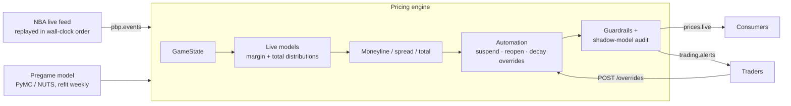
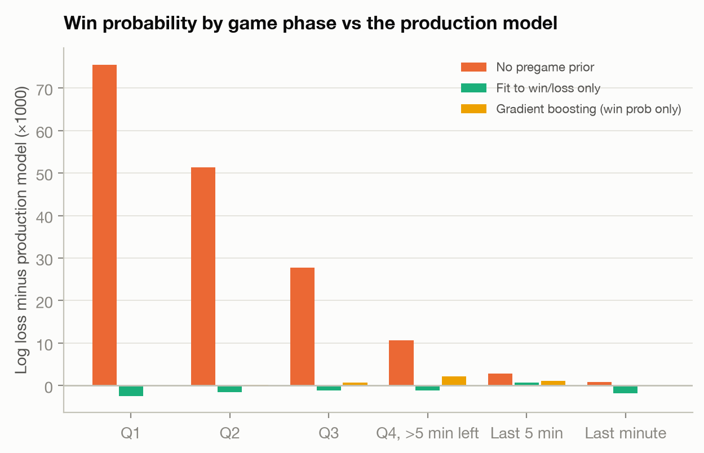
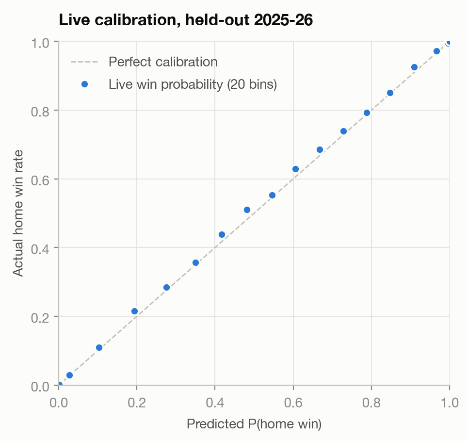
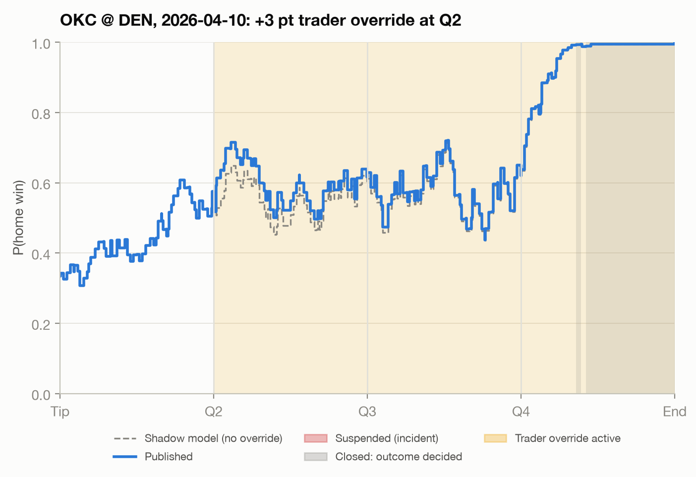
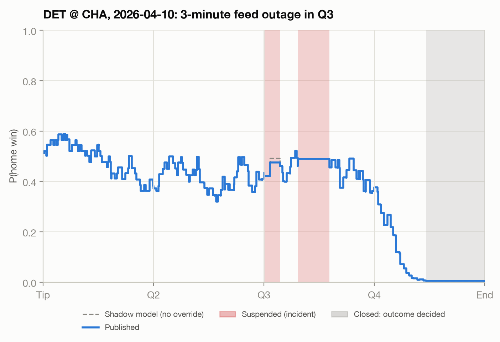

# Live NBA Pricing Engine

**Bayesian pregame ratings → live win-probability, spread and total pricing → trader
automation and guardrails, streamed over Kafka.** Built and validated on 4,920 NBA games
and 2.75 million live-feed events (2022-23 through 2025-26).



## Results at a glance

| | Result (held-out data) |
|---|---|
| Pregame model | Bayesian off/def ratings by MCMC, walk-forward over 2,460 games. Win probability ties Elo (log loss 0.612 vs 0.615, difference not significant), **and adds calibrated margin and total distributions** (80% intervals cover 80.7% / 81.4%) that spreads and totals need. |
| Live win probability | Log loss **0.3757** on 155k states from 2025-26, slightly ahead of gradient boosting on the same inputs (0.3757 vs 0.3764) and far ahead of no pregame prior (0.407). One distribution prices moneyline, spread and total coherently, with 80% margin intervals covering **80.0%**. |
| Live total | Final-total CRPS **5.8** vs 13.1 for pace extrapolation. A fitted close-game fouling term improves the last 5 minutes. |
| Replay of the busiest night (15 games) | Caught an injected feed outage and an unreviewed parameter hot-edit (8 games suspended with alerts, all reopened once it was reverted), and dropped 249 late or duplicate events. Applied and decayed a trader override. |
| Latency / throughput | **p50 53 µs, p99 63 µs** per event; the full 2025-26 season (708k events) at **~19k events/s** on one core |
| Engineering | 31 tests, CI with a real-broker Kafka integration test, Docker image smoke test, Kubernetes manifests, model-config lock |

## 1. Pregame: Bayesian team ratings by MCMC

`src/livepricing/ratings.py`

```
home_pts ~ mu + hca/2 + off[home] − def[away]     (bivariate normal,
away_pts ~ mu − hca/2 + off[away] − def[home]      correlated through pace)
off, def ~ ZeroSumNormal(0, σ_off / σ_def)         (partial pooling)
```

The model is fit with NUTS in PyMC. Older games count less: the likelihood is weighted by
`0.5^(age / half-life)`. Every week the model is **refit on games played before that week
only**, and predicts the next block, so there is no look-ahead anywhere. The half-life was
tuned on 2023-24 (45 / 90 / 180 days; 90 won), then frozen for the 2024-25 and 2025-26
test seasons. Each fit takes ~6 s, with r-hat 1.00 and bulk ESS > 500.

| 2024-25 + 2025-26 (2,460 games) | Log loss | Brier | Accuracy |
|---|---|---|---|
| Home-court rate only | 0.690 | 0.249 | 54.9% |
| Elo (FiveThirtyEight-style, MOV multiplier) | 0.615 | 0.213 | 66.3% |
| **Bayesian ratings (MCMC)** | **0.612** | **0.212** | **67.2%** |

A paired bootstrap puts the log-loss gain over Elo at 0.004 (95% CI −0.006 to +0.013).
**On win probability alone the two are statistically tied.** The reason to run the
Bayesian model is that it outputs a full predictive distribution for margin and total. Its
80% intervals covered 80.7% of final margins and 81.4% of totals, and Elo has no
equivalent.

**Finding: the pregame margins are over-shrunk.** Regressing actual margin on predicted
margin gives a slope of 1.28, not 1.0. Time-decay weighting reduces each team's effective
sample size, so the hierarchical prior pulls ratings toward zero too hard. The live layer
corrects for this with a fitted drift calibration. It lands at β = 1.29, independently
matching the 1.28 slope. The upstream fix, a dynamic-rating model, is in next steps.

## 2. Live models

`src/livepricing/live.py`. Fit on 2024-25 game states, tested on all of 2025-26 (155k
states, snapshotted every 30 s of game clock, every 5 s in the last 3 minutes).

**Margin.** The remaining margin follows a drifted random walk (after Stern, 1994), with
mean reversion of the current lead:

```
final margin ~ Normal( α(f)·margin + v·possession + β·μ₀·f ,  σ²·f^γ )
α(f) = 1 − (a₀ + a₁·f)·f
```

Here f is the fraction of the game left, μ₀ the pregame expected margin, β the drift
calibration, α the share of the current lead expected to survive, and γ < 1 means
volatility rises late. The parameters are fit by maximum likelihood **on final margins**,
not just on who won.

**Finding: leads mean-revert.** A pure random walk systematically underrated trailing
teams: home underdogs won 4.3 points more often than predicted. The fitted α says about
**21% of a halftime lead is expected to disappear** (leaders ease off, trailers press).
Adding it was the single largest improvement, and it removed the bias.

| 2025-26 | Win-prob log loss | Margin CRPS | 80% interval coverage |
|---|---|---|---|
| **Production model** | 0.3757 | **4.833** | **0.800** |
| without lead mean-reversion | 0.3808 | 4.882 | 0.800 |
| without drift calibration (β = 1) | 0.3791 | 4.856 | 0.800 |
| without late-volatility term (γ = 1) | 0.3766 | 4.837 | 0.803 |
| without possession | 0.3766 | 4.841 | 0.797 |
| without the pregame prior | 0.4071 | 5.223 | 0.776 |
| same form, fit to win/loss only | **0.3746** | 4.983 | 0.876 |
| gradient boosting, same inputs (win prob only) | 0.3764 | — | — |

Every component improves both metrics. **A deliberate trade-off:** fitting the same form
to win/loss outcomes alone gives a marginally better moneyline log loss (0.3746). But its
implied margin distribution is too wide (87.6% coverage at a nominal 80%), which misprices
spreads. A moneyline from one model and a spread from another can contradict each other,
which the guardrails reject. Production prices all three markets from one calibrated
distribution and gives up 0.001 of moneyline log loss to do it. It also edges out gradient
boosting (0.3764), which can't produce a spread at all.




**Total.** Scoring is modeled as a rate process with a Gamma prior centered on the
pregame total, updated by observed scoring. Two findings came out of fitting it:

- **In-game pace adds nothing beyond the pregame total.** The fitted prior strength runs
  to its bound: a high-scoring first half did not predict a high-scoring rest of game in
  2024-25. The model tests this hypothesis and rejects it, which keeps an intuitive but
  noisy signal out of the price. Pure pace extrapolation scores CRPS 13.1, vs 5.8.
- **Close games late get fouling points.** In the last 5 minutes of games within 10
  points, ~2.5 extra points get scored beyond the projection; outside 10 there is no
  effect. A fitted `close_bonus` term captures it and cuts last-minute CRPS from 1.54 to
  1.45.

## 3. The engine and trader automation

`src/livepricing/engine.py`, `state.py`, `pricing.py`, `guardrails.py`

For every feed event the engine advances the game state, prices the three markets with
4.5% vig, and applies automation:

| Rule | What it does | How it was set |
|---|---|---|
| Material-move filter | Publish only if fair probability moved ≥ 0.5 pp or a line moved | config |
| Jump circuit breaker | Suspend after a ≥ 12 pp single-event move, reopen after 2 events | config |
| Stale feed | Suspend when the feed is silent longer than is normal **after that kind of action** | **learned**: 99.9th-pct silence per action type on 2024-25, e.g. 64 s after a 3-pointer, 269 s after a timeout, 1,011 s after a period break |
| Outcome decided | Close the market past 99.5%, rather than raising a false alarm | config |
| Trader override | A points view on a game (e.g. injury news) that shifts all three markets coherently and decays with a 6-minute game-clock half-life | config, validated |
| Late / duplicate events | Dropped. Every action carries the running score, so the newest event is authoritative | — |

**Train/serve parity.** Possession after each event is inferred by basketball rules. A made
FG or final free throw flips it, a rebound goes to the rebounder, a turnover flips it. The
`GameState` code that computes this builds the training data *and* runs in the engine. The
rules agree with the feed's own next-possession field 98% of the time outside loose-ball
moments.

### Replay: the busiest night of 2025-26, with incidents

`scripts/run_replay.py` streams all 15 games of 2026-04-10 through the bus in wall-clock
order and injects:

| Incident | What the system did |
|---|---|
| 179 events resent late (~2%), plus 70 the real feed posted out of order | 249 dropped; prices unaffected |
| 3-minute feed outage, DET @ CHA, Q3 | Suspended once the silence passed the learned threshold (detected at 202 s); reopened when the feed resumed |
| Trader: +3 points on DEN at Q2 ("injury news") | Accepted, audited, decayed back to the model (top chart) |
| Someone hot-edits σ by −25% without review | **Every game where it moved the price by > 2 pp (8 of 15) was suspended with an alert** (10 alerts). All reopened once the divergence cleared or the config was reverted |
| Real long stoppages (flagrant-foul review, injury halts) | 3 suspensions. From the feed alone a review looks like an outage, so suspending is correct |




## 4. Catching unexpected changes from manual interactions

Three layers, from commit time to runtime:

1. **Config lock (CI).** Every price-moving number lives in `config/model.json`.
   `config/model.lock` records its hash plus the prices it produces for seven golden game
   states. A hand edit fails CI (`tests/test_config_lock.py`) until someone runs
   `scripts/update_lock.py`, which produces a reviewable diff showing exactly which prices
   moved.
2. **Shadow model (runtime).** The engine also prices every event with the reviewed config.
   If the live price differs by more than declared overrides explain (> 2 pp), it alerts
   and suspends that market until the cause is fixed. This caught the hot edit above.
3. **Override guardrails.** Overrides need a trader ID and reason, are capped at ±4 points,
   and are audited (`GET /audit`). Every quote must pass coherence invariants before it is
   published: the moneyline favorite must be the spread favorite, the spread must be
   centered, the total line can't be below points already scored, and the overround must
   be on target.

## 5. Running it

```bash
python -m venv .venv && source .venv/bin/activate
pip install -e ".[model,kafka,dev]"

python scripts/run_pregame_backtest.py   # downloads data, MCMC walk-forward (~15 min)
python scripts/run_live_eval.py          # fits live models, writes config + lock
python scripts/run_replay.py             # slate replay with incidents + season throughput
pytest                                   # 31 tests (+ Kafka test when KAFKA_BOOTSTRAP is set)

docker compose up --build                # Redpanda + engine + replayer at 60x real time
curl localhost:8000/markets              # live quotes;  /metrics for Prometheus
```

**Deployment.** The image serves only the engine; PyMC fitting stays offline. In AWS, that
maps to MSK for the broker, EKS for `deploy/k8s/engine.yaml`, and ECR for the image.
Events are keyed by `game_id`, so a game stays ordered within one partition and the
consumer group scales out to the partition count. CI lints, runs the tests and config
lock, starts a Redpanda broker for an end-to-end Kafka test (events in, prices out), then
builds and smoke-tests the Docker image.

## Limitations and next steps

- **No market odds.** The real benchmark for a pricing model is closing lines and CLV.
  With Swish's market data I'd evaluate against those, and add market moves as an external
  signal alongside the feed.
- **Replay, not live.** Events are replayed with their original timestamps. Feed latency
  and the network are not modeled.
- **No player-level information.** Injuries and rest enter only through trader overrides.
  A player-impact layer on the pregame model is the natural extension.
- **Fix the shrinkage upstream.** Replace time-decay weighting with a dynamic-rating model
  (team strength as a random walk), so the live drift calibration (β = 1.29) is
  unnecessary.
- **Distributional ML.** A distributional booster that predicts margin mean and variance
  from richer state (fouls, timeouts, lineups) could beat the parametric model while
  keeping the markets coherent.

## Layout

```
src/livepricing/
  data.py         feed parsing, home/away + possession resolution, learned stale thresholds
  ratings.py      Bayesian ratings (PyMC/NUTS) + Elo benchmark
  backtest.py     walk-forward refits, scoring (log loss, Brier, CRPS, coverage)
  live.py         margin + total models, fitting, game-state snapshots
  state.py        Event / GameState shared by training and serving
  pricing.py      odds, vig, half-point lines
  engine.py       pricing engine, automation, overrides, shadow audit, metrics
  guardrails.py   quote invariants and override validation
  config.py       versioned config, lock, golden states
  bus.py          in-memory and Kafka buses;  replay.py / replay_cli.py  feed replay
  service.py      FastAPI: markets, overrides, params, audit, metrics
scripts/          pregame backtest, live eval, replay, lock update
config/           model.json (reviewed parameters) + model.lock
deploy/k8s/       Kubernetes manifests;  Dockerfile, docker-compose.yml
```

Data: public mirror of the NBA live-data feed at
[shufinskiy/nba_data](https://github.com/shufinskiy/nba_data).
